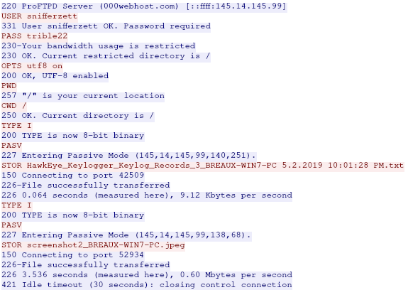
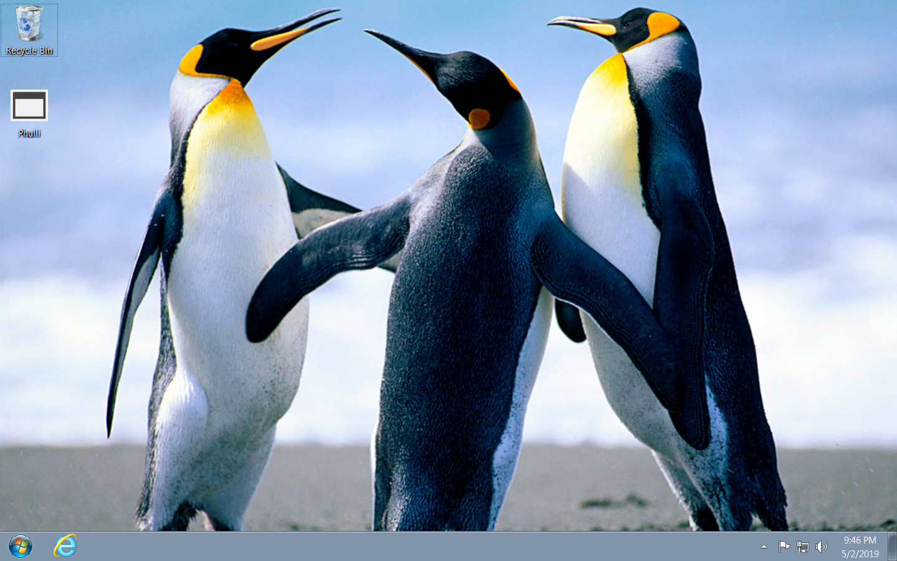

# PEC1 - Parte 3

## Primera actividad 

### LAN segment data:

* LAN segment range:  172.17.8.0/24 (172.17.8.0 through 172.17.8.255)
* Domain:  timbershade.info
* Domain controller:  172.17.8.2 - Timbershade-DC
* LAN segment gateway:  172.17.8.1
* LAN segment broadcast address:  172.17.8.255

### Anotaciones propias

Dispositivos en la red:

1. 172.17.8.109 (Posiblemente maquina infectada) `GET http://91.121.30.169:8000/91msE95B/actiV.bin`
1. 172.17.8.2 (server with DNS record timbershade-dc.timbershade.info)
1. 192.241.220.183
1. 204.2.193.184 (Windows server)
1. 216.239.94.252
1. 23.50.224.8 (Windows server)
1. 91.121.30.169 (Posiblemente servidor maligno) `http://91.121.30.169:8000/91msE95B/actiV.bin`

* Filtrando por `tcp.stream eq 50` conseguimos ver la transferencia del archivo desde el servidor maligno hacia nuestra maquina infectada.

Para averiguar el tipo de malware o, directamente, si es o no un malware, he copiado en hash y lo he buscado en la base de datos de VirusShare, en la que he encontrado que efectivamente, [si es un virus.](https://www.virustotal.com/gui/file/9f6e3e65aedca997c6445329663bd1d279392a34cfda7d1b56461eb41641fa08/detection)

Analizando la entrada de texto en el archivo `.txt`, el sistema IDS da a entender que el malware con el que estamos infectados es: Dridex.

### Tablas con las respuestas a la primera actividad

Questions | Answers
:-----|:------
What is the IP address of the infected Windows host? | 172.17.8.109
What is the MAC address of the infected Windows host | 14:fe:be:de:15:ca
What is the host name of the infected Windows host | DUNA-WINDOWS-PC
What is the Windows user account name for the infected Windows host | margaren.duna
What is the SHA256 file hash of the Windows executable file sent to the infected Windows host? | 9f6e3e65aedca997c6445329663bd1d279392a34cfda7d1b56461eb41641fa08
Based on the IDS alerts, what type of infection is this? | Dridex

## Segunda actividad 

### LAN segment data

* LAN segment range:  10.0.0.0/24 (10.0.0.0 through 10.0.0.255)
* Domain:  beguilesoft.com
* Domain controller:  10.0.0.10 - BeguileSoft-DC
* LAN segment gateway:  10.0.0.1
* LAN segment broadcast address:  10.0.0.255

### Resumen ejecutivo

El 02/05/2019, a las 21:36, el ordenador usado por adriana breaux ha mostrado evidencias de estar infectado con el malware "HawkEye Keylogger".

El malware realiza capturas de pantalla y recolecta cuentas y contraseñas del dispositivo infectado y las manda a un proveedor de servicios de Internet con dominio 000webhost.com.
Desde este servidor, puede visualizar las capturas de pantalla realizadas por el malware, ademas de obtener la lista de contraseñas y cuentas a las que pertenecen.

### Detalles de la maquina infectada

* *IP Address:* 10.0.0.227
* *MAC Address:* 84:8a:69:09:86:ca
* *Host Name:* BREAUX-WIN7-PC
* *Windows User Account Name:* adriana.breaux

### Indicadores de compromiso

* *IPs transferencia capturas de pantalla:* 145.14.145.99, 145.14.144.10, 145.14.145.4
* *Dominio al que se han enviado los archivos:* files.000webhost.com
* *Captura de pantalla de la sesion FTP realizada por el Malware:* 
* *SHA256 de archivo transferido mediante FTP que contiene cuentas y contrasenas:*
    * c69e9a9a3099d596f47f1862a741a4e6ac96de7e877c77866ca530068010e8fa
* *SHA256 y captura de pantalla y del ordenador de la victima* 
    * 57c13c1937e4c1d7a587d983d8c22887ec1ea23528499c09a4299f0e00292f15  
    * 
